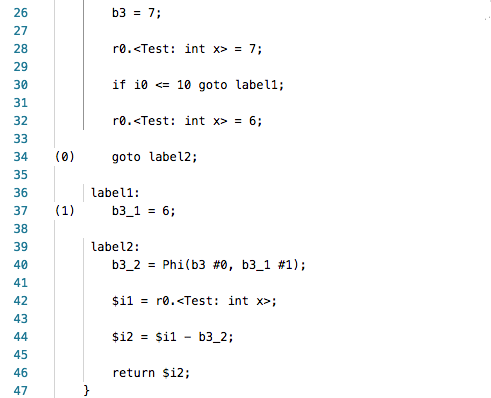

# 《软件分析测试》 课程作业 - 部分SSA转换
- 罗雯波，MG1933100

## 代码说明
本次作业所使用的程序由**JAVA**语言编写，并采用**SOOT**分析框架来进行部分SSA的转换。*Test.java*是用于分析的程序的源代码，SOOT工具在*lib*目录下。

## 分析过程
首先使用命令  
> javac Test.java

编译源代码。

接着使用命令
> java -jar lib/sootclasses-trunk-jar-with-dependencies.jar -cp . -pp -f shimple Test 

即可生成部分转换为SSA的中间代码，在*sootOutput*目录下。

## 分析结果
源代码如下

部分转换成SSA后，部分的中间代码（对应源代码 6 - 13 行）如下

可以看到源代码中变量 *x* 对应的 *r0*.<Test: int> 分别在第 28 与第 32 行上被复制，未被转换成 SSA。
而变量 *y* 则对应于 *b3*，*b3_1* 和 *b3_2* 等多个变量，满足 SSA 的转换。